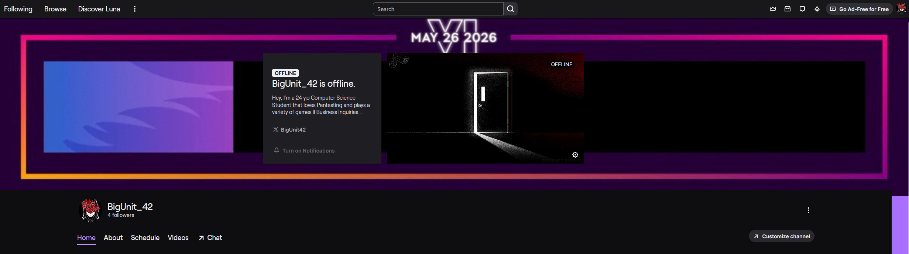
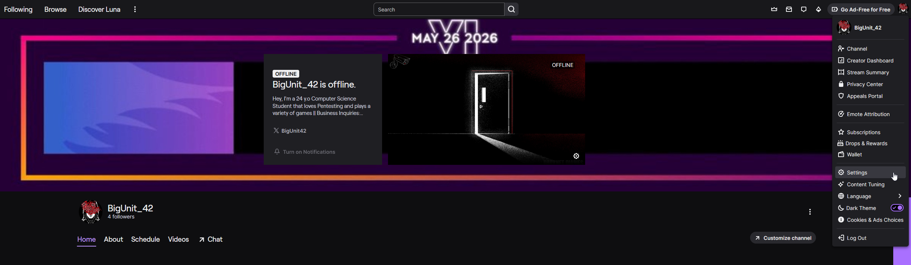
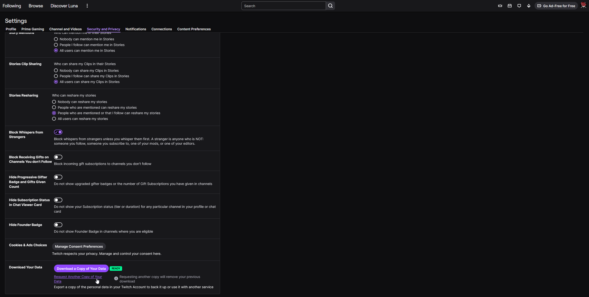

# Twitch Chat Viewer

A modern web application that displays your Twitch chat data in a beautiful, Twitch-like interface. Import your CSV file and browse your chat history with powerful filtering and search capabilities.

## How to Get Your Twitch Chat Data

Before using this viewer, you'll need to request your data from Twitch. Here's how:

### Step 1: Navigate to Twitch Settings

- Go to your Twitch profile and click on your avatar in the top-right corner
- Select "Settings" from the dropdown menu
- This will take you to your account settings page

### Step 2: Access Privacy Settings

- In the settings sidebar, look for the "Security and Privacy" section
- Click on the privacy-related options to access data management features
- Navigate to the data download section

### Step 3: Request Your Data

- Find the "Download Your Data" section at the bottom of the privacy settings
- Click on "Download a Copy of Your Data" button
- Twitch will process your request and email you a download link when ready
- This process can a couple of days to complete

**Note**: Your data package will include various files, but you'll specifically need the chat message data (usually in CSV format) for this viewer.

### What to Expect in Your Data Download

When Twitch processes your data request, you'll receive a ZIP file containing multiple folders:

- **Account Information**: Basic profile data
- **Chat Messages**: Your chat history across all channels (this is what you need!)
- **Follows**: Channels you follow
- **Prime/Turbo**: Subscription history
- **Video History**: VODs you've watched
- **And more**: Various other account activities

The chat messages file will typically be named something like `chat_messages.csv` and contains columns for:
- Timestamp
- Channel name
- Your username
- Message content
- User ID and other metadata

### Converting Your Data

Once you have your chat data CSV file, you can optionally use the included PowerShell scripts to clean and convert the data:

- **`convert-csv-to-txt.ps1`**: Simple conversion script
- **`convert-csv-to-txt-enhanced.ps1`**: Enhanced version with data cleaning options

Or simply upload your CSV file directly - the web application will automatically convert and clean it!

## Getting Started

1. **Open the Application**: Open `index.html` in your web browser
2. **Import Your Data**: 
   - Drag and drop your CSV file onto the upload area, or
   - Click "Choose File" to browse and select your file
3. **Browse Your Chats**: 
   - Select channels from the sidebar to view their messages
   - Use search to find specific messages or users
   - Apply date filters to narrow down time ranges

## Supported File Formats

### CSV Files
The application automatically detects and maps common column names:
- `time`, `timestamp`, `server_timestamp` → Message timestamp
- `login`, `username` → Username
- `body`, `body_full`, `message` → Message content
- `channel` → Channel name
- `user_id` → User ID
- `country`, `city` → Location data
- `is_reply`, `is_mention` → Message metadata

### XLSX Files
Excel files are parsed using the same column mapping as CSV files.

## Sample Data Format

Your CSV/XLSX file should include these columns (column names are flexible):

```csv
time,login,body,channel,user_id,country,city
2020-10-31 12:48:11,username123,Hello world!,channelname,12345,US,New York
2020-10-31 12:49:15,anotheruser,Nice stream!,channelname,67890,CA,Toronto
```

## Features in Detail

### Chat Interface
- **Message Display**: Messages are displayed with timestamps, usernames, and channel tags
- **User Colors**: Each username gets a consistent, unique color
- **Emote Detection**: Common Twitch emotes are highlighted
- **Search Highlighting**: Search terms are highlighted in yellow

### Filtering & Search
- **Channel Filter**: Search channels by name in the sidebar
- **Message Search**: Search across all messages in the selected channel
- **Date Range**: Filter messages by start and end dates
- **Real-time Results**: All filters update instantly as you type

### Data Statistics
- **Total Messages**: See your total message count across all channels
- **Channel Count**: View how many different channels you've chatted in
- **Per-channel Stats**: Each channel shows its message count

## Browser Compatibility

This application works in all modern browsers:
- Chrome 70+
- Firefox 65+
- Safari 12+
- Edge 79+

## Technical Details

### Built With
- **HTML5** - Semantic markup and file handling
- **CSS3** - Modern styling with Flexbox and Grid
- **JavaScript ES6+** - Modern JavaScript features
- **Papa Parse** - CSV parsing library
- **SheetJS** - Excel file parsing
- **Font Awesome** - Icons
- **Google Fonts** - Inter font family

### File Processing
- Files are processed entirely in the browser (no server required)
- Support for files up to 100MB
- Automatic column detection and mapping
- Error handling for malformed data

## Privacy & Security

- **100% Client-side**: All file processing happens in your browser
- **No Data Upload**: Your chat data never leaves your computer
- **No Tracking**: No analytics or tracking scripts
- **Offline Capable**: Works without an internet connection (after initial load)

## Troubleshooting

### File Won't Load
- Ensure your file is in CSV format
- Check that required columns (time, message, channel, username) are present
- Verify the file isn't corrupted

### Missing Messages
- Check if date filters are applied
- Verify the timestamp format in your data
- Ensure the channel name matches exactly

### Performance Issues
- Large files (>50MB) may take time to process
- Consider splitting very large datasets into smaller files
- Close other browser tabs to free up memory

## Contributing

This is an open-source project. Feel free to:
- Report bugs or suggest features
- Improve the code or documentation
- Add support for additional file formats
- Enhance the UI/UX

## License

MIT License - Feel free to use this code for your own projects!
